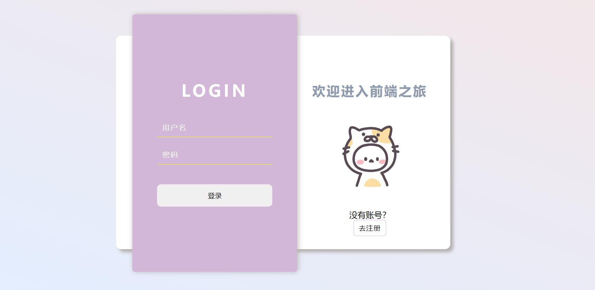
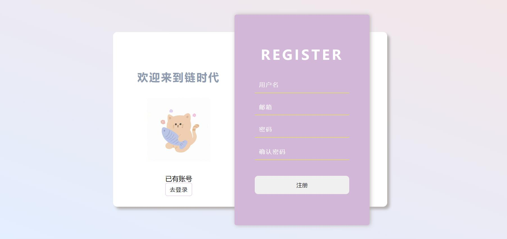

# 前端方向招新题

## JavaScript

### 题目一    移动方块小游戏

---

**题目要求** ： 

题目会给定一个demo，这个demo会包含一个需要你移动的方块1（小）和一个目标方块2（大），你需要完善程序，实现能够用键盘控制控制方块1的移动，当方块1完全进入方块2时，弹出一个提醒框 ” 游戏结束 “

**基本功能点 ** ：

- 键盘控制方块的移动
- 小方块进入大方块后出现弹窗

[demo下载]: www.lianshidai.com.cn/js1.zip

**出题人**：郭翔

### 题目二	登录注册页面

---

> 众所周知，前端页面设计需要你尽可能做得看起来~~花里胡哨~~优美高雅，例如我们美丽的uestc邮箱登陆界面!

**题目要求**：

实现一个登录注册网页界面的设计，包括背景区域与登录区域，有登录按钮和注册按钮 

**基本功能点：**

+ 能够输入用户名和密码 

**进阶功能点：**

+ “去注册”按钮，可以切换到注册界面 
+ 切换回注册界面 

**提示：**

 + background: linear-gradient( ) 实现渐变背景
 + box-shadow  实现阴影效果
 + transition       实现动画效果
 + hidden           实现隐藏效果
 + 用JS实现点击切换~~纵享丝滑~~

（尽可能实现多的要点，当然可以按照自己的思路设计。）

 **出题人**：easton

### 题目三 🤩来点美照  

---

> 小明发现身边的人都非常的帅气&漂亮（~~特别是咱们电子科技大学的大一新生~~），但是小明作为一个不怎么社交的人，虽然总是会发现帅哥/美女，但是都还不认识。希望帅气/漂亮的同学们可以将自己的照片（明星的也行，照片没有严格的要求）制作成轮播图，并在下面用表格简单介绍一下自己，帮一帮社恐的小明吧。

**题目要求：**

实现一个简单的轮播图，图片为自己的照片（或者喜欢的明星），并在下方用表格简单地介绍一下自己 

**基本功能点** ：

- 图片展示区能够定时自动切换图片
- 点击底部栏对应的标识点，可以直接切换到对应的图片

**出题人：** Olivia  

### 题目四 🥺好想谈恋爱啊

---

>单身多年的小明内心一直渴望一段甜甜的恋爱，今天在机缘巧合之下他打开了某个相亲网站，看到了下面这个表单。小明也想自己做一个这样表单放在自己的网站上~~要是能收集到plmm的信息就更好了~~

**题目要求：**

+ 本题要求实现与实例一样的表单。

**提示：**

+ 不要求实现提交到服务器，只需要实现前端布局就可以了。
+ 希望所在地区使用下拉表单元素（随便编几个城市就行了）

**出题人：** Olivia  

### 题目五 扇

---

>CSS3的功能相当强大，它的内置动画功能可以取代许多网页动画图像、Flash 动画和 JavaScript 实现的效果，甚至更加丝滑流畅。
>
>下面是一个简单的动图，相信学习了CSS动画的你一定能实现！

**题目要求：**

本题要求通过CSS的内置动画功能实现以下gif的效果。

**基本功能点：**

+ 当鼠标光标悬停在矩形上时能自动散开
+ 不需要符合十分精确的角度，形似即可

**出题人：** 不如吃茶去

### 题目六 个人简介

---

**题目要求：**

实现如以下图片展示的自我介绍网页,具体内容与布局可以有出入（例如工作经历可以不写，绩点可以不写，写一下自己的兴趣爱好或者生平事迹均可），最好有自己的布局与设计哈（这也是本题考察的重点）

**基本要求:**

+ ***必须要写为什么选择前端方向与对前端的理解***
+ 照片可以随便放噻，可以是喜欢的明星、动漫人物等
+ 联系方式家庭住址等隐私信息可以虚拟，本题考察的是布局
+ 想写啥就写啥，工作室包容所有xp，期待你滴小作文

**提示：**

+ 最好使用弹性布局
+ 如果有自己的UI原型图可以随招新题一并发来，可以加分噻！

**出题人：** 不如吃茶去